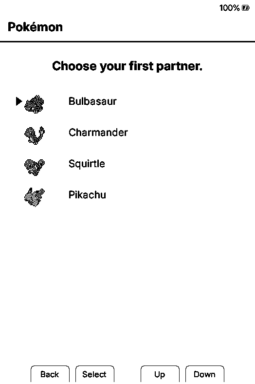
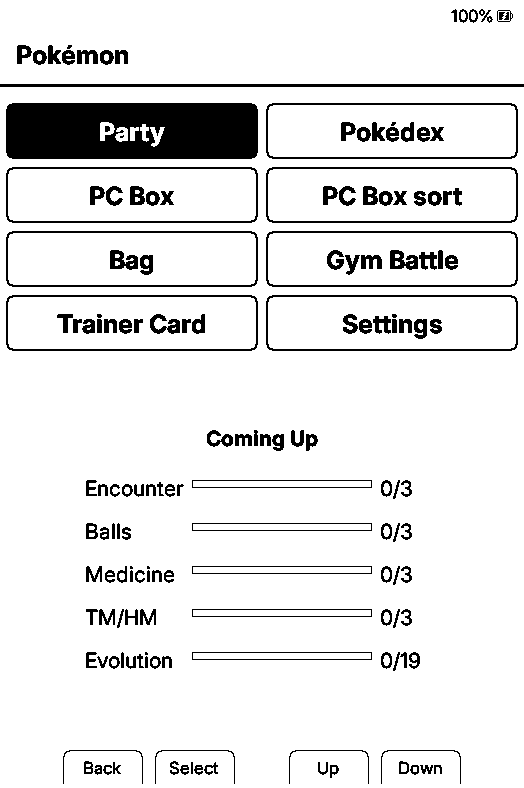
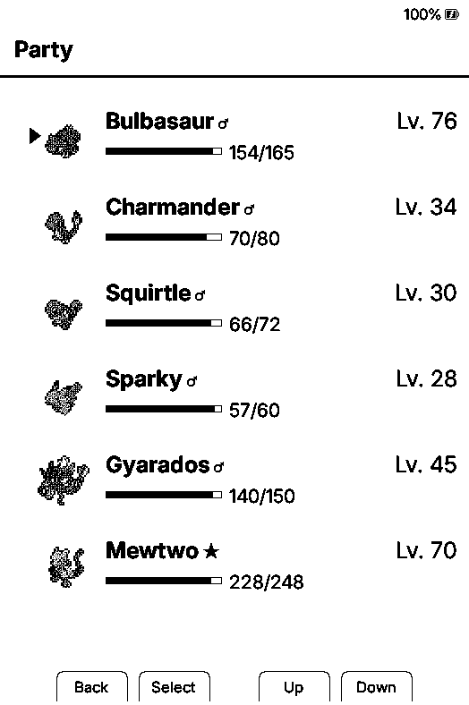
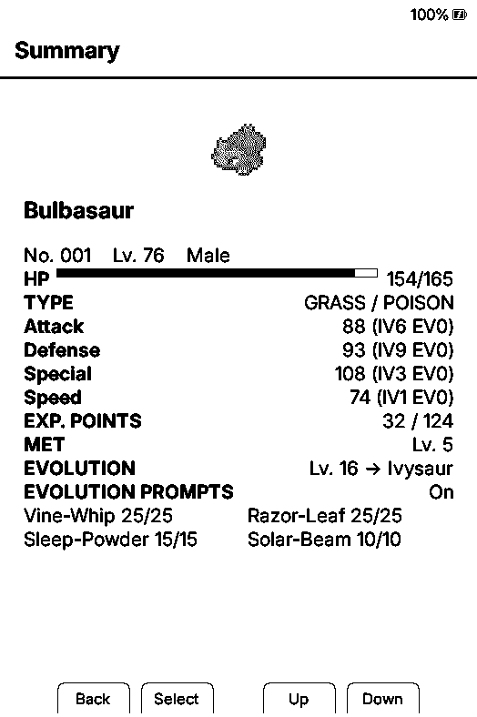
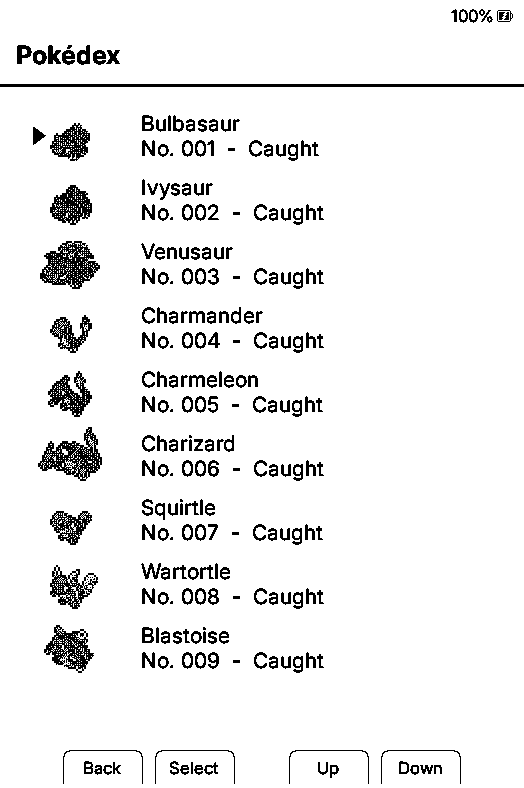
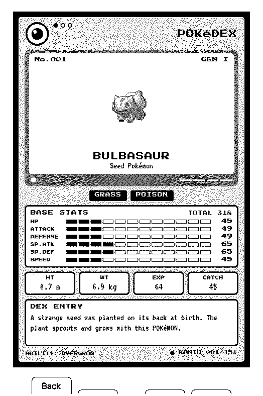

# Xteink Pokémon Game

This project builds on [padge01's original idea](https://github.com/padge01/xteink-pokemon-game) for a reading-powered Pokémon companion, adding a full battle system and many more items to collect. It's based on CrossInk, turning the reading companion concept into a full Pokémon game built around CrossInk's reading sessions and dashboards.

Real page turns train your lead Pokémon, trigger wild encounters and item finds, and let you build a party, battle gyms, and complete a Pokédex — all driven by time spent actually reading.

## How it works

For the full picture — Gym Leaders, evolution, the Pokédex, Trainer Card, Hall of Fame,
shiny Pokémon, and an honest list of what's simplified from the original games — see
[The Pokémon game](docs/pokemon-game.md). Short version:

Put the Pokémon you want to train at the top of your Party. As you read, it gains experience and levels up, learning new moves along the way.

While you read, wild Pokémon encounters and item finds happen on their own — a `!` on the dashboard tells you something is waiting in the Pokémon menu. Meeting a wild Pokémon starts a short turn-based battle: weaken it, then throw a Poké Ball to try to catch it. Balls, potions, status-curing items, and TMs/HMs are found the same way, just while reading.

Once your team is strong enough, challenge the eight Gym Leaders, the Elite Four, and finally the Champion, in order, to earn badges and complete the challenge. Evolution stones, level-up evolutions, and a full 151-entry Pokédex round out the loop.

Only active reading counts — leaving a book open without turning pages does not train your Pokémon.

## Screenshots

These are current X3 simulator captures using the artwork included in the full install.

| Starter selection | Pokémon menu |
| --- | --- |
|  |  |

| Party | Summary |
| --- | --- |
|  |  |

| Pokédex | Pokédex entry |
| --- | --- |
|  |  |

## How to play

1. Choose Bulbasaur, Charmander, Squirtle, or Pikachu as your first partner. Choose its gender and give it a nickname if you want one.
2. Put the Pokémon you want to train at the top of your Party. Only your lead Pokémon gains experience while you read.
3. When a `!` appears on the dashboard, open the Pokémon menu to see what happened.
4. Meeting a wild Pokémon opens a battle — fight it down, then throw a ball to try to catch it, or run. Your Party holds six; additional Pokémon go to the PC Box.
5. Reorder your Party and deposit or withdraw Pokémon from the PC Box.
6. Manage moves from a Pokémon's Summary screen, use items and TMs/HMs from the Bag, and use evolution stones or Link Cables when you have them. Level-based evolutions ask before changing your Pokémon and can be turned off from its summary.
7. Once your team can handle it, take on the Gym Leaders in order from the Pokémon menu to earn badges, then the Elite Four, then the Champion.
8. Fill the original 151 Pokédex entries by catching and evolving Pokémon.

## Download and install

- [Download from GitHub Releases](https://github.com/thebitsworld/xteink-pokemon-game/releases)

Confirmed working on physical hardware on **Xteink X3**, **Xteink X4**, and **Xteink X4
Pro** (X4 Pro has a touch-only UI, portrait orientation), including both locked and
unlocked devices. **X3/X4 and X4 Pro firmware are not interchangeable** — they target
different chips (ESP32-C3 vs. ESP32-S3), though the updater checks for this and refuses a
mismatched file rather than bricking anything. Do not install on Sticky or another device.

| Your device | Download |
| --- | --- |
| Xteink X3 or Xteink X4 | [Latest X3/X4 firmware](https://github.com/thebitsworld/xteink-pokemon-game/releases/latest/download/xteink-pokemon-x3-x4-firmware-latest.bin) |
| Xteink X4 Pro | [Latest X4 Pro firmware](https://github.com/thebitsworld/xteink-pokemon-game/releases/latest/download/xteink-pokemon-x4-pro-firmware-latest.bin) |

Install it over Wi-Fi from **Settings → System → Updates → Check for Updates**, or copy
the `.bin` to the SD card and use **Settings → System → SD Card Firmware Update**. Either
way, also grab that release's `xteink-pokemon-sd-card-assets.zip` and copy its `pokemon`
folder to the SD card root — that's the Pokémon sprites, item icons, badges, and Pokédex
cards, shipped separately from the firmware. Full walkthrough, including what to do if
something doesn't match: [Installation](docs/installation.md).

Your books, reading data, and Pokémon save are never touched by an update — see
[The Pokémon game](docs/pokemon-game.md#your-save-is-separate-from-your-books).

Building from source? See [Getting Started](docs/development/getting-started.md).

## Credits

- [padge01](https://github.com/padge01/xteink-pokemon-game): the original idea for a reading-powered Pokémon companion on the Xteink X3, which this project builds on
- [CrossInk](https://github.com/uxjulia/CrossInk): the reader firmware, reading-session tracking, dashboards, and foundation for this project
- [CrossPoint Reader](https://github.com/crosspoint-reader/crosspoint-reader): the original firmware and upstream 1.5 improvements brought into this CrossInk build
- [Joshua Miller's CrossPoint Reader Companion](https://github.com/JoshuaMillerCode/crosspoint-reader-companion): the reading companion concept and verified-reading behavior
- [PokeAPI Sprites](https://github.com/PokeAPI/sprites): the source for the adapted Pokémon sprites
- [u/xDaftTurtle's Pokédex sleep-screen project](https://www.reddit.com/r/XTEINK/comments/1ve0pr4/comment/p1lpy0w/?context=3): the adapted X3 Pokédex cards, created with [Tesserae](https://github.com/dmellok/tesserae)
- [Pokémon Database](https://pokemondb.net/red-blue/gymleaders-elitefour): the source for the adapted Gym Leader, Elite Four, and Champion portraits

See [NOTICE.md](NOTICE.md) and [Rights and attribution](RIGHTS_AND_ATTRIBUTION.md). Project code is covered by the inherited [MIT License](LICENSE).

Pokémon and related names, characters, and artwork belong to their respective rights holders. This is an unofficial fan project and is not affiliated with or endorsed by Nintendo, Creatures Inc., GAME FREAK Inc., The Pokémon Company, Xteink, CrossInk, or CrossPoint Reader.

## Development notes

- [Release checklist](docs/release-checklist.md)
- [Artwork and packaging](docs/artwork-setup.md)
- [Save-file formats](docs/file-formats.md)
- [Pokémon battle system roadmap](docs/development/pokemon-battle-roadmap.md)
- [Xteink X4 Pro support roadmap](docs/development/pokemon-x4pro-roadmap.md)

### TODO / future consideration

- [Pokémon Red authenticity gap analysis](docs/development/pokemon-gen1-authenticity-roadmap.md) - a prioritized list of real Gen 1 mechanics not yet modeled (stat stages, critical hits, IVs/EVs, recoil/multi-hit moves), with impact/cost notes for tackling them in future phases.
